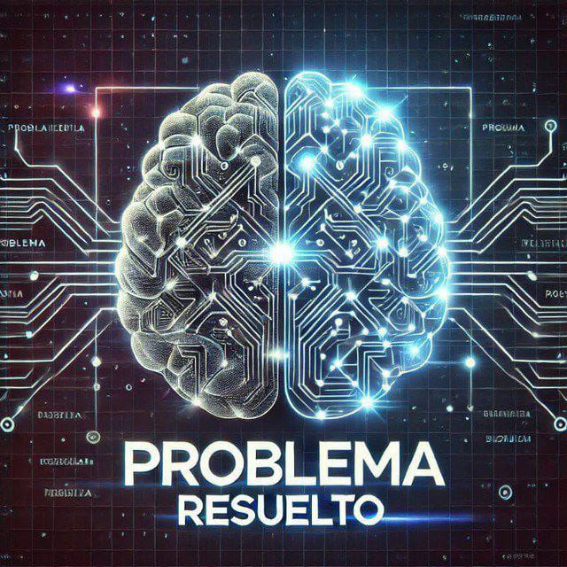

<p align="center">
  
</p>

<h1 align="center">⚡ Retos de Programación </h1>

<p align="center">
  Este repositorio guarda todos los retos que publico en <strong>mi canal de Telegram</strong> 
  Puedes resolverlos en el lenguaje que prefieras y contribuir con tu solución.  
  ¡Aquí practicamos programación y entrenamos el pensamiento lógico! 💻💜
  <br>
</p>

<hr>

<div align="center">

  <h3>🔔 ¡Apoya este proyecto!</h3>

  <ul style="list-style: none;">
    ⭐ <strong>Dale una estrella</strong> para que más personas lo descubran
    <br>
    🙌 <strong>Sígueme en GitHub</strong> para ver más proyectos educativos
     <br>
   
  </ul>

  <p align="center">

  <p align="center">
  <a href="https://github.com/liztechcode"></a>
  <a href="https://github.com/liztechcode/problema-resuelto"></a>
</p>

</div>

<hr>
 


## 📚 Tabla de Retos


| #  | Nombre del reto | Soluciones | Teoría 📚  | Video solución 🎥    |
|----|-----------------|------------|------------|----------------------|
| 01 | [](https://t.me/problemaresueltoo/18) | [](./retos/vectores/Aleatorios.java) || [](https://youtu.be/COHbI09cFHg) |
| 02 | [](https://t.me/problemaresueltoo/30) | [](./retos/estructuras-datos/pilas/ExpresionesPostfijas.java) | [](https://www.youtube.com/watch?v=WvUdg41FnNY)|  |
| 03 | [](https://t.me/problemaresueltoo/36) |  [](./retos/fundamentos/triangulo.py) |  
| 04 | []([https://t.me/problemaresueltoo/36](https://t.me/problemaresueltoo/44)) |  [](./retos/fundamentos/matrices/agentes_secretos.js) |  


---

## 🤝 ¿Cómo contribuir?

¿Quieres aportar tus soluciones o proponer nuevos retos? ¡Genial! Sigue estos pasos:

### 1️⃣ Haz un fork del repositorio

- Pulsa el botón "Fork" en la parte superior derecha de esta página
- Clona tu fork: `git clone https://github.com/TU-USUARIO/problemas-resueltos-programacion.git`
- Añade el repositorio original como remoto: `git remote add upstream https://github.com/USUARIO-ORIGINAL/problemas-resueltos-programacion.git`

### 2️⃣ Crea una rama para tu aporte

```bash
git checkout -b nombre-de-tu-rama
```

### 3️⃣ Haz commit y push de tu solución
- - Haz COMMIT con el mensaje de la solución git commit -m "#[NÚMERO-RETO] - [LENGUAJE-UTILIZADO(javascritp, c++, java, python,go..etc)]".

### 4️⃣ Envía un Pull Request

- Haz push a tu rama: `git push origin nombre-de-tu-rama`
- Ve a GitHub y crea un nuevo Pull Request
- Describe brevemente tu solución

### ⚠️ Recomendaciones

- Usa un estilo de código limpio y consistente
- Explica tu enfoque de manera clara y concisa
- ¡Diviértete y aprende en el proceso! 🚀

